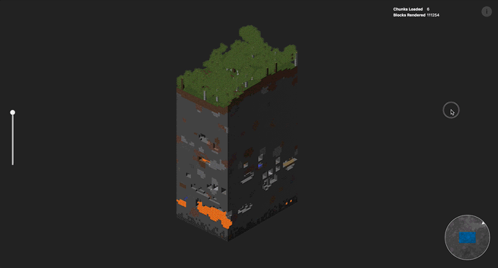

## Minecraft Chunk Viewer | [Demo](http://pessimistress.github.io/minecraft/)



## Preparing

1. Copy or link to your Minecraft texture assests to ```./assets/textures``` under the project directory. The target minecraft asset directory should contain the following structure:
```
blockstates/
font/
lang/
loot_tables/
models/
shaders/
structures/
texts/
textures/
```
  For more information on extracting textures from your Minecraft installation see [Minecraft Overviewer's instructions on: Installing the Textures](http://docs.overviewer.org/en/latest/running/#installing-the-textures).

## Running
2. Run the following commands from the project root directory, and ignore any warnings.
```
npm install
npm build-asset
npm start
```

## Contributors

* [Xiaoji Chen - @Pessimistress](https://github.com/Pessimistress)
* [Rob MacKinnon - @rmackinnon](https://github.com/rmackinnon)

## Credits

Minecraft and all of its content belong to [Mojang](http://mojang.net).

We learned about the mca file format, the block behaviors and almost everything else Minecraft, from the [Minecraft Wiki](http://minecraft.gamepedia.com/).

Region files are parsed using [minecraft-region](https://github.com/maxogden/minecraft-region).

Rendering is handled using [deck.gl](https://github.com/uber/deck.gl), a framework for WebGL based visualizations.
